# Lab5 Git操作指南

## 第一部分：基础操作
1. &zwnj;**创建GitHub仓库**&zwnj;
- 登录GitHub、点击右上角 ➕ > "New repository"、输入仓库名lab5、复制仓库HTTPS/SSH地址

2. &zwnj;**克隆仓库到本地**&zwnj; 
 ```bash
    git clone https://github.com/Jyhqq/lab5
    cd lab5
 ```

3. &zwnj;**添加文件**&zwnj;
- 创建example.txt  并添加内容：
- 提交更改
 ```bash
    git add example.txt 
    git commit -m "添加示例文件"
    git push origin main
 ```
<div align="center">
  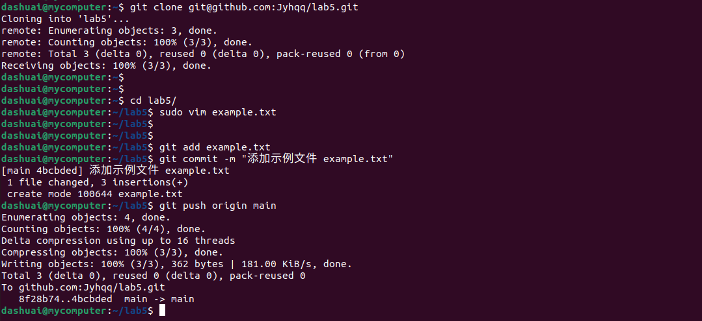
</div>

## 第二部分：分支管理
4. &zwnj;**创建功能分支**&zwnj;

 ```bash
    git branch feature-branch
    git checkout feature-branch
 ```
<div align="center">
  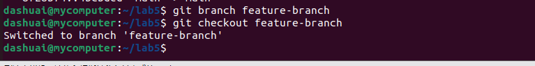
</div>
5.  &zwnj;**修改并提交**&zwnj;

- 编辑example.txt 添加新内容

- 提交更改：

 ```bash
    git add .
    git commit -m "功能分支修改"
    git push origin feature-branch
 ```
<div align="center">
  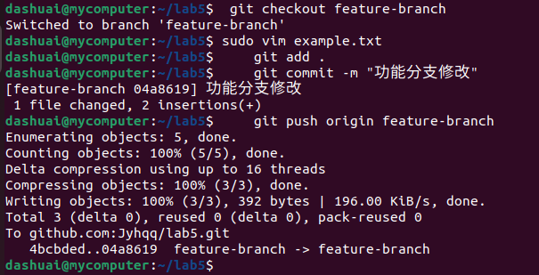
</div>

6.  &zwnj;**合并分支**&zwnj;
 ```bash
    git checkout main
    git merge feature-branch
    git push origin main
 ```
<div align="center">
  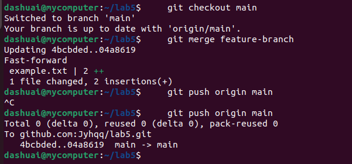
</div>

## 第三部分：分支开发实战
7.  &zwnj;**创建登录功能分支**&zwnj;
 ```bash
    git checkout -b feature-login
 ```
8. &zwnj;**添加新章节**&zwnj;
- 修改example.txt ：
- 提交更改：

 ```bash
    git add example.txt 
    git commit -m "添加登录章节"
    git push origin feature-login
 ```
<div align="center">
  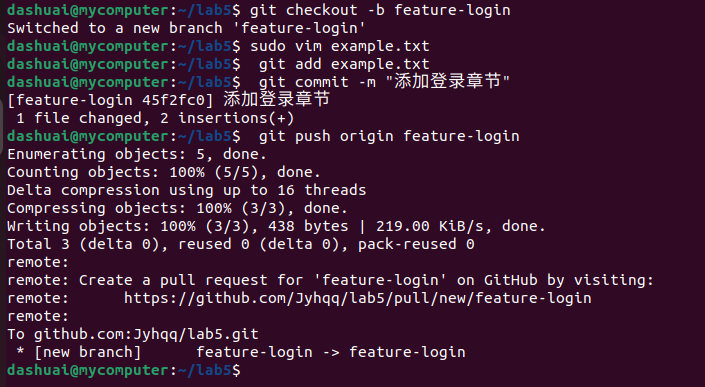
</div>
 
## 第四部分：冲突解决
9. &zwnj;**模拟冲突**&zwnj;
- 分支修改
 ```bash
    git checkout feature-login
 ```
- 触发冲突
 ```bash
    git checkout main
    git pull origin main
 ```
<div align="center">
  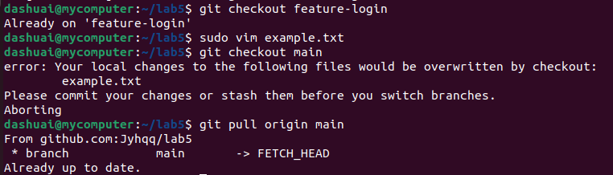
</div>

10. &zwnj;**解决冲突**&zwnj;
- 合并时出现冲突标记：
- 提交最终版本：
 ```bash
    git add example.txt 
    git commit -m "解决第2章内容冲突"
    git push origin main
 ```
<div align="center">
  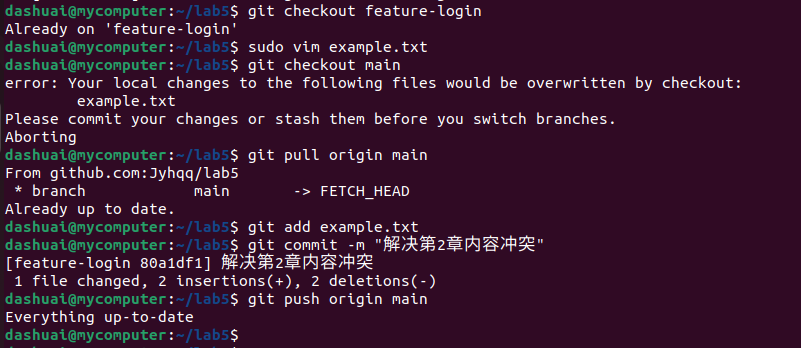
</div>

## 第五部分：自动格式检查
11. &zwnj;**创建pre-commit钩子**&zwnj; 

- 在项目根目录创建.git/hooks/pre-commit

- 添加检查脚本：

 ```bash
    #!/bin/bash
    # 检查所有.txt文件
    for file in $(git diff --cached --name-only | grep "\.txt$")
    do
        # 示例检查：必须包含章节标题
        if ! grep -q "## 第" "$file"; then
            echo "错误：$file 缺少章节标题"
            exit 1
        fi
    done
 ```
- 添加执行权限：

 ```bash
    chmod +x .git/hooks/pre-commit
 ```
<div align="center">
  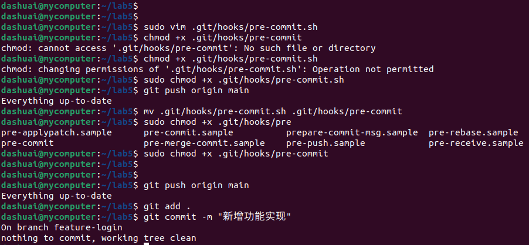
</div>

## Git Flow 工作流实践

12. &zwnj;**环境准备**&zwnj; 

 ```bash
    sudo apt-get install git-flow  # 安装依赖
    git flow init                 # 初始化工作流
 ```
 <div align="center">
  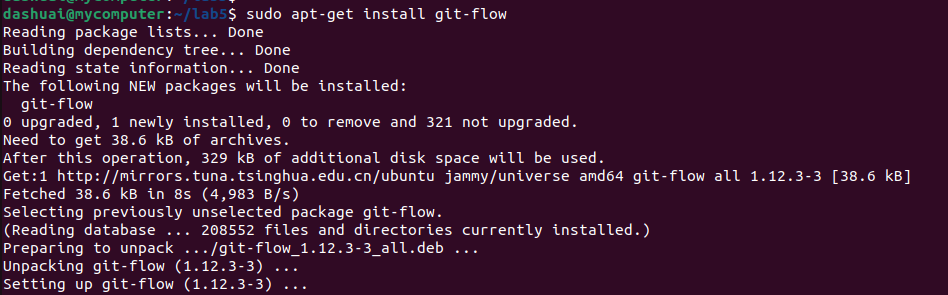
</div>

13. &zwnj;**功能开发**&zwnj;

 ```bash
    git flow feature start task-management  # 创建任务管理功能分支
 ```
- 实现功能（示例代码）：
 ```python

    # task_manager.py
    def create_task(title, description):
        """新建任务逻辑"""
        print(f"[系统] 创建新任务：{title}")
 ```
- 提交变更：

 ```bash
    git add task_manager.py
    git commit -m "实现任务创建基础功能"
 ```

13. &zwnj;**完成功能开发**&zwnj;

 ```bash
    git flow feature finish task-management  # 自动合并到 develop 分支
 ```
 <div align="center">
  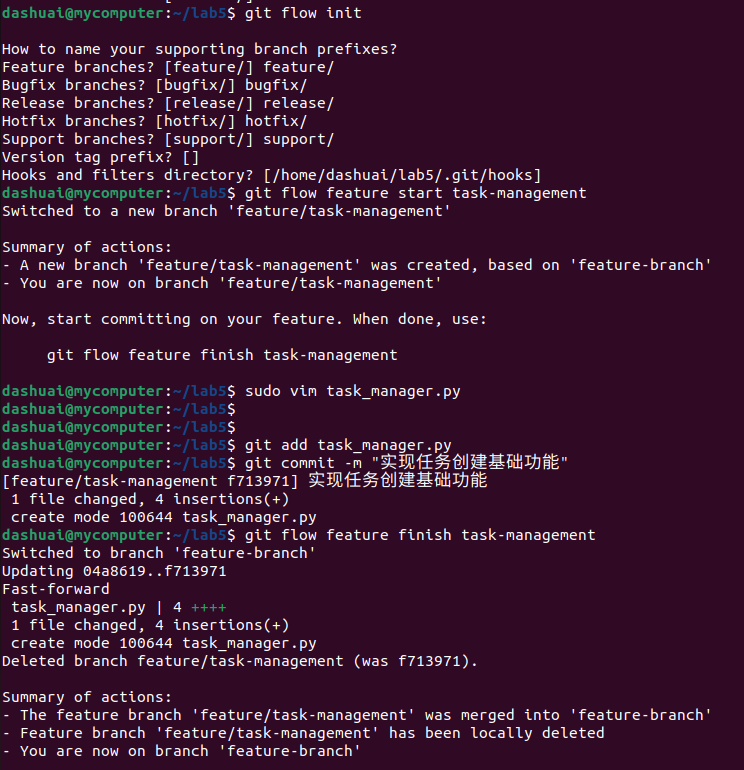
</div>

14. &zwnj;**版本发布**&zwnj;

 ```bash
    git checkout develop
    git flow release start v1.0.0    # 创建发布分支
    echo "v1.0.0" > version.txt      # 更新版本号
    git add version.txt
    git commit -m "版本升级 v1.0.0"
    git flow release finish v1.0.0   # 合并到 main/develop
```
<div align="center">
  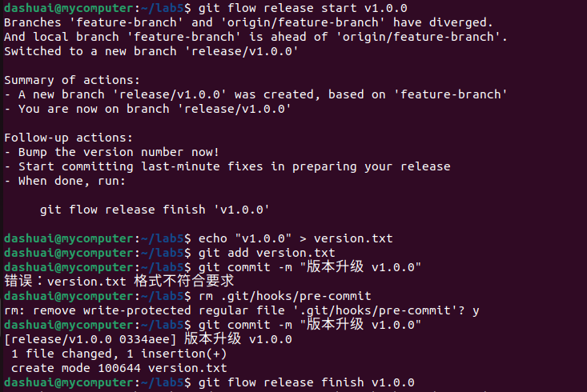
  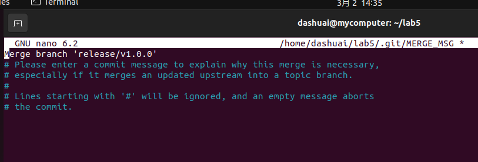
</div>
15. &zwnj;**紧急修复**&zwnj;


 ```bash
    git flow hotfix start hotfix-1.0.1  # 创建热修复分支
    # 修复问题代码...
    git add file_with_error.py
    git commit -m "修复权限校验漏洞"
    git flow hotfix finish hotfix-1.0.1 # 合并修复到主分支
 ```
 <div align="center">
  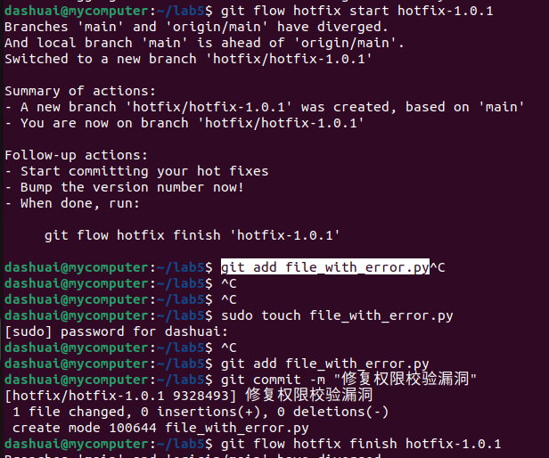
  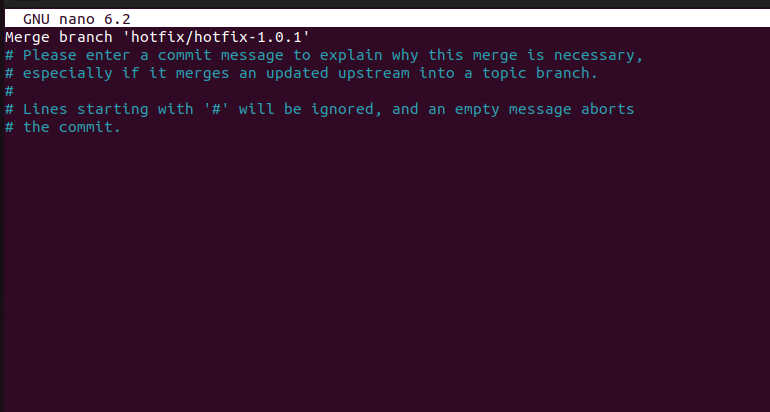
</div>
15. &zwnj;**同步远程仓库**&zwnj;

 ```bash
    git push origin develop  # 推送开发分支
    git push origin main     # 推送主分支
 ```
  <div align="center">
  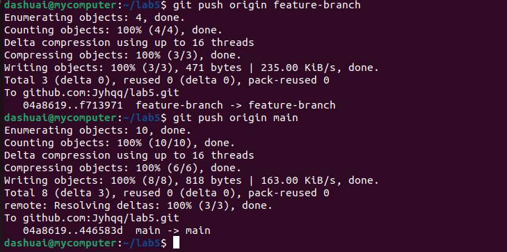
</div>